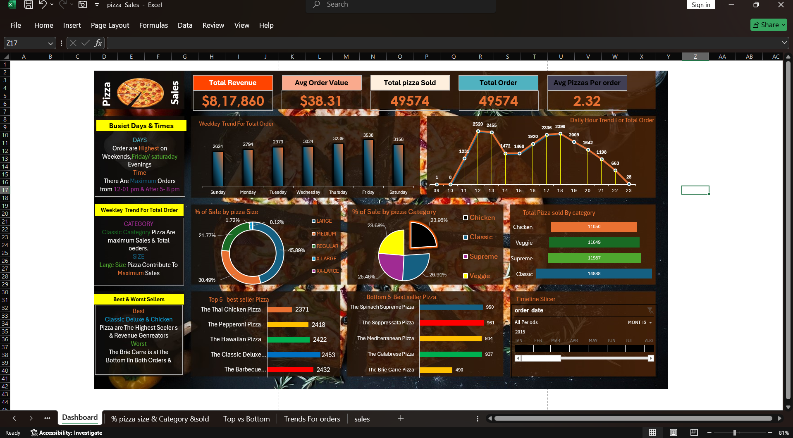

# 🍕 Pizza Sales Analysis Using Excel

A visually rich data analysis project focused on understanding pizza sales trends. Built completely in **Microsoft Excel**, this dashboard reveals key business insights such as top-selling items, peak hours, and revenue breakdowns.

---

## 📌 Project Overview

This project helps answer important business questions like:
- When do customers place the most orders?
- Which pizza sizes and categories drive the most revenue?
- Who are the top 5 and bottom 5 performing pizzas?
- What are the busiest days and hours?

---

## 🧰 Tools Used

- **Microsoft Excel** – Data Cleaning, Analysis & Dashboard

---

## 🖥️ Dashboard Preview



---

## 📊 Key Insights

- **Peak Ordering Time:** Between 12 PM to 1 PM and 5 PM to 8 PM  
- **Best Days for Sales:** Friday and Saturday  
- **Top-Selling Pizzas:** Classic Deluxe & Chicken  
- **Worst Performer:** The Brie Carre Pizza  
- **Highest Revenue Contributor:** Large-size, Classic Category  
- **Average Order Value:** $38.31  
- **Total Orders:** 49,574  
- **Total Revenue:** $8,17,860

---

## 📁 Project Structure

```
📂 Pizza-Sales-Excel-Analysis/
├── 📊 Slicing-and-Dicing-Data-A-Pizza-Sales-Analysis.png
├── 📘 README.md
└── 📎 Dataset (coming soon, optional)
```

---

## 📬 Contact

**Bobby Rameshchandra Dubey**  
[LinkedIn](https://www.linkedin.com/in/bobbydubey) • [GitHub](https://github.com/Bobby95453)

---

⭐ If you like this project, give it a star to support my work!
